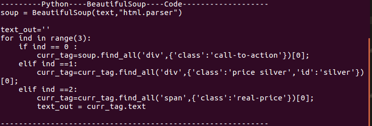

Soupy_Paste
==========

Soupy_Paste is just a quick utility to use your clipboard to generate Beautiful Soup code for python
by copying from the html of a the smallest set of unique tags <></> .

Setup 
------
You can make sure some dependencies by using the installDependencies.sh script as sudo

Usage image
------
The idea is to just copy (ctrl+C) the unique set of tags in the html (ctr+U) of site like in the following screenshot

Then you use either the Wx gui or terminal version and generate the bs4 code

